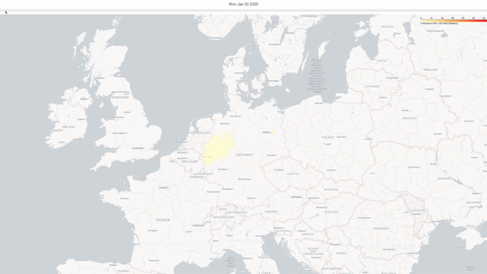
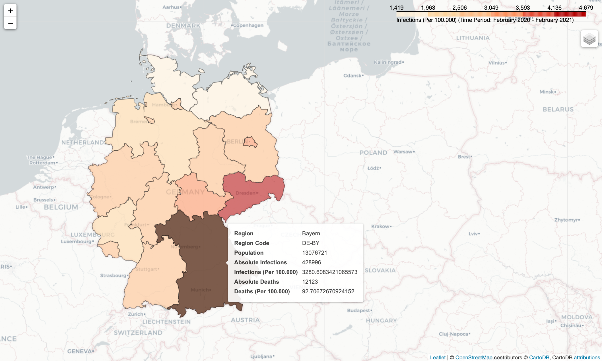
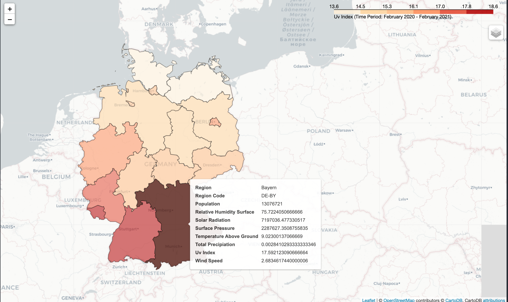
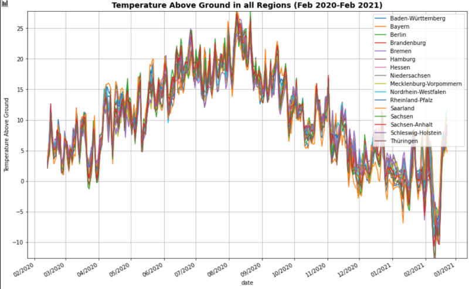
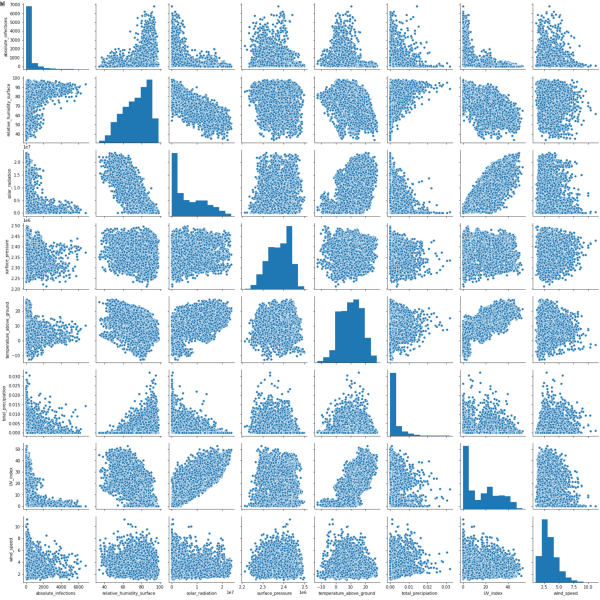

# Project 2: Spatial Data Science
## The influence of Weather onto the spread of Covid-19 in Germany
---

In this project, we have completed tasks similar to data scientists working for a public health agency, to inform central governments about possible correlates between COVID-19 and environmental factors facilitating or hampering  its  spread. We have explored the latest data set of all infections in the year 2020 provided by the government, and weather data from the IBM Pairs system.  

The major parts of the project are:
- Exploring and transforming the data, making numerical and visual reports
- Connecting data tables (weather, infections)
- Investigating possible statistical associations by filtering for a variety of attributes
- Visualizing the data on a map
- Involving self-obtained external data sets in the analysis.

## Background and Motivation
---
The COVID-19 pandemic, also known as the coronavirus pandemic, is an ongoing pandemic of coronavirus disease 2019 (COVID-19) caused by severe acute respiratory syndrome coronavirus 2 (SARS-CoV-2). It was first identified in December 2019 in Wuhan, China. The World Health Organization declared the outbreak a Public Health Emergency of International Concern in January 2020 and a pandemic in March 2020. As of 5 March 2021, more than 115 million cases have been confirmed, with more than 2.56 million deaths attributed to COVID-19, making it one of the deadliest pandemics in history. (Source: [Wikipedia](https://en.wikipedia.org/wiki/COVID-19_pandemic)).

The goal of this project is to analyse the development of the pandemic in Germany from February 2020, while paying special attention to environmental factors that may relate to higher chances of infection and therefore a faster spread of the pandemic.

## Some Visualisations of the Project
---

### Spatial Visualisation
Annual Relative Number of Infections per Region |  Annual UV-Index  | 
:-------------------------:|:-------------------------:
   |  |

### Statistical Analysis
Temperatures in all Regions       |  Scatterplot between all Environmental Variables and Absolute No. of Infections
:-------------------------:|:-------------------------:
   | %